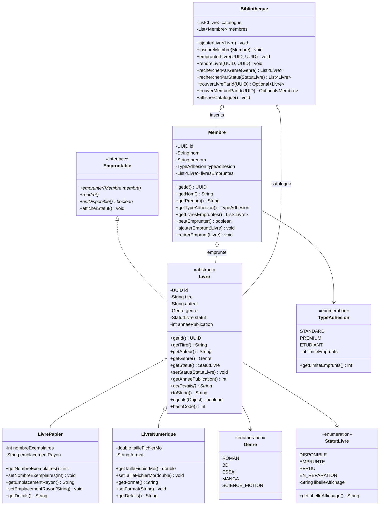

# 📚 Système de Gestion de Bibliothèque Java (Library Management System)

> **Architectural Review & Documentation by:**  
> **Marcus Sterling** — *Senior Principal Software Engineer & Java Architect*

---

## 📌 Présentation du Projet

Ce projet est une application Java orientée objet simulant un système complet de gestion d'une bibliothèque municipale ou universitaire. Il permet la gestion du catalogue d'ouvrages (physiques et numériques), l'inscription des membres avec différents profils d'adhésion, la gestion des emprunts et des retours avec règles métier strictes, ainsi que la recherche multicritère par filtres.

Ce projet a été conçu selon les standards du développement orienté objet (POO) en Java moderne :
- Encapsulation stricte et immutabilité
- Polymorphisme d'héritage et d'interface
- Programmation orientée contrat (`Interface` vs `Implementation`)
- Gestion robuste des exceptions métier
- Traitement déclaratif des collections avec l'API **Java Streams**

---

## 🏛️ Architecture & Modèle de Domaine

### Diagramme de Classes (Mermaid)



---

## 📁 Structure des Répertoires et Packages Recommandée

Pour respecter les conventions professionnelles Java (Maven/Gradle et standard JDK), les sources doivent être structurées ainsi :

```text
src/
└── bibliotheque/
    ├── app/
    │   └── Main.java                    # Point d'entrée exécutable (CLI / Scénario de test)
    ├── enums/
    │   ├── Genre.java                   # Genres littéraires
    │   ├── StatutLivre.java             # Statuts d'un ouvrage avec libellé textuel
    │   └── TypeAdhesion.java            # Formules d'adhésion et quotas d'emprunt
    ├── exceptions/
    │   ├── LimiteEmpruntAtteinteException.java # Levée si quota d'emprunt dépassé
    │   └── LivreIndisponibleException.java     # Levée si livre déjà emprunté/perdu
    ├── modele/
    │   ├── Empruntable.java             # Contrat d'emprunt
    │   ├── Livre.java                   # Entité abstraite de base
    │   ├── LivrePapier.java             # Spécialisation ouvrage physique
    │   ├── LivreNumerique.java          # Spécialisation livre électronique
    │   └── Membre.java                  # Adhérent de la bibliothèque
    └── service/
        └── Bibliotheque.java            # Service métier et orchestration du catalogue
```

---

## ⚙️ Compilation et Exécution

### Option 1 : Via Ligne de Commande (JDK 17+)

1. Compiler l'ensemble des fichiers source :
   ```bash
   javac -d out $(find src -name "*.java")
   ```
   *(Sur Windows PowerShell)* :
   ```powershell
   Get-ChildItem -Recurse -Filter *.java | ForEach-Object { $_.FullName } | Out-File -Encoding ascii sources.txt
   javac -d out @sources.txt
   ```

2. Exécuter le programme principal :
   ```bash
   java -cp out bibliotheque.app.Main
   ```

### Option 2 : Via IntelliJ IDEA / Eclipse

1. Ouvrir le projet dans l'IDE.
2. S'assurer que le répertoire `src` (ou les sous-dossiers configurés) est marqué comme **Sources Root**.
3. Exécuter la classe `Main` (raccourci `Shift + F10` dans IntelliJ).

---

## 🛠️ Règles Métier Clés

1. **Génération d'Identifiant Unique :**  
   Chaque `Livre` et `Membre` possède un `UUID` immuable (`final`) généré automatiquement à l'instanciation.
2. **Encapsulation Défensive :**  
   Les listes internes (`livresEmpruntes`, `catalogue`, `membres`) ne doivent jamais être exposées directement en écriture. `Membre.getLivresEmpruntes()` renvoie une vue non modifiable (`Collections.unmodifiableList`).
3. **Contrôle des Quotas :**  
   Tout emprunt est conditionné au respect de `typeAdhesion.getLimiteEmprunts()`. Une tentative d'emprunt au-delà lève une exception dédiée `LimiteEmpruntAtteinteException`.
4. **Disponibilité des Livres :**  
   Un livre physique n'est disponible que si son statut est `StatutLivre.DISPONIBLE` et que `nombreExemplaires > 0`.
5. **Polymorphisme à l'Affichage :**  
   La méthode `Livre.toString()` applique le patron *Template Method* en s'appuyant sur l'implémentation spécifique de `getDetails()` fournie par `LivrePapier` et `LivreNumerique`.

---

## 👨‍💻 Auteur et Évaluation

- **Développeur de base :** Ilyas Sekhsoukhi
